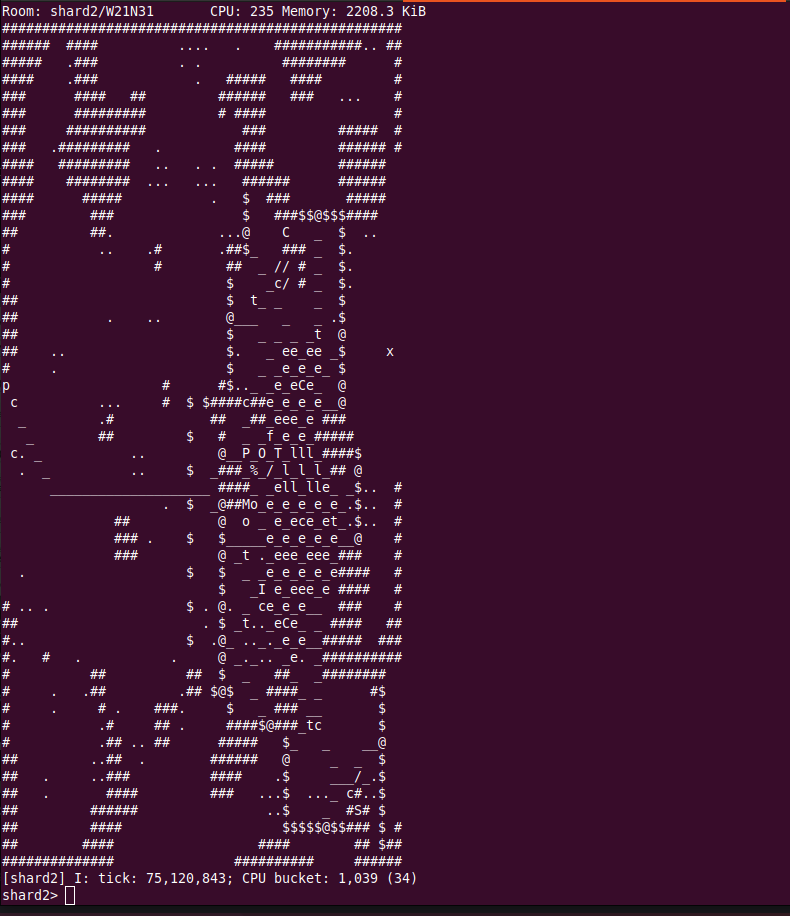

This example uses the HTTP API and the WebSocket API to implement a rudimentary text-based client that runs in a terminal.

The HTTP API is used to fetch room terrain, while the WebSocket API is used to stream updates to room objects and all other client state.

This script will abort with an error when the dimensions of the terminal it is running in are too small.

Type the name of a room to begin rendering it. Input that does not match the
format of a room name will be evaluated as an expression on the client's default shard.

{@includeCode terminal-client.ts}
